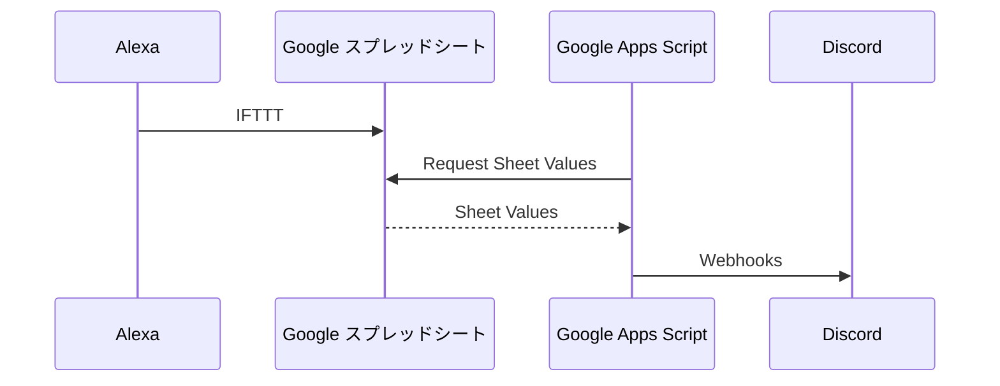

# gas-shopping-list-notification
Alexa買い物リスト通知

スプレッドシートに記載されたAlexa買い物リストの内容を読み取り、  
内容に変更があった場合Discordに通知する。




## プロジェクトのデプロイ
```
npm run deploy
```

## appsscript.jsonのダウンロード
```
npm run pull
```
